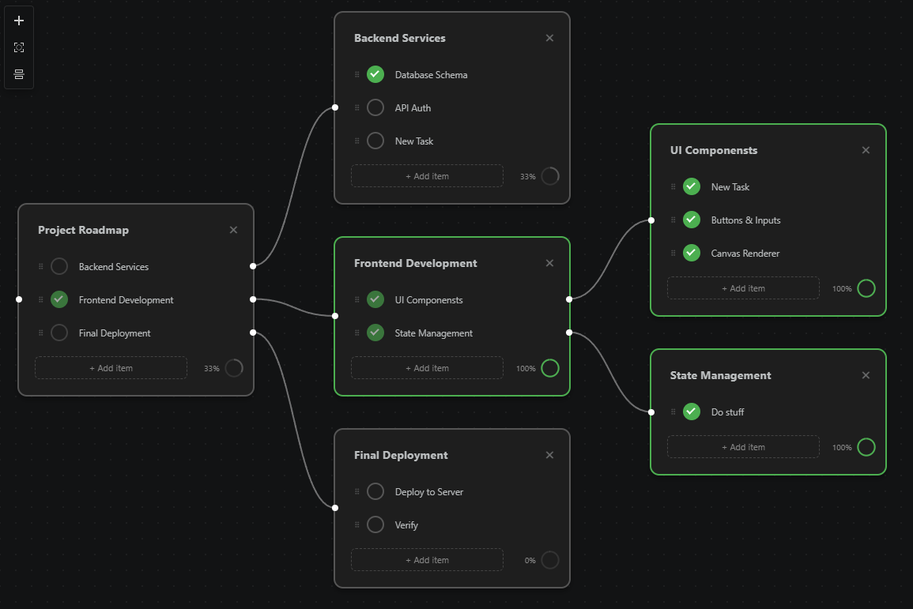

# Tree TODO List

With this extension you can create todo lists in a tree-like structure where tasks can depend on each other. This helps you visualize the hierarchy of your goals and see exactly what needs to be completed first.

**Inspired by [treetodolist.com](https://www.treetodolist.com/).** If you are looking for a feature-rich cloud version with sync and collaboration, definitely check them out!

## Table of Contents

- [Tree TODO List](#tree-todo-list)
  - [Table of Contents](#table-of-contents)
  - [Getting Started](#getting-started)
  - [Features](#features)
  - [Commands](#commands)
  - [Extension Settings](#extension-settings)
  - [Known Issues](#known-issues)

## Getting Started

1. Create a new file with the `.treetodo` extension (e.g., `my-tasks.treetodo`).
2. Alternatively, use the command `TreeTodo: New Tree Todo List` to generate an example file.
3. The custom visual editor will open automatically.

## Features

- **Visual Tree Editor**: Manage tasks in a spatial, node-based layout.
- **Task Dependencies**: Link items to sub-tasks to create a clear progression path.
- **Progress Tracking**: Automatic progress calculation for tasks based on their sub-items.
- **Auto-Layout**: Tasks can be automatically reordered to maintain a clean structure.
- **Local Files**: All data is stored in simple JSON-based `.treetodo` files within your workspace.

## Commands

- `TreeTodo: New Tree Todo List`: Create a new file with an example task.
- `TreeTodo: View Source`: View the raw JSON content of the `.treetodo` file.
- `TreeTodo: Open Editor`: Switch back to the visual custom editor.

## Extension Settings

- `tree-todo-list.maxPasses`: Maximum number of iterations to resolve cascading state changes (default: 10). Increase this for very deep trees.
- `tree-todo-list.autoReorderTasks`: Automatically reorder tasks to match the order of items in their parent tasks.

## Known Issues

- **Autosave Conflict**: Using [Files: Auto Save](vscode://settings/files.autoSave) with a short delay can cause text inputs to lose focus or reset if you type slowly. It is recommended to use `onFocusChange` or `onWindowChange`.

